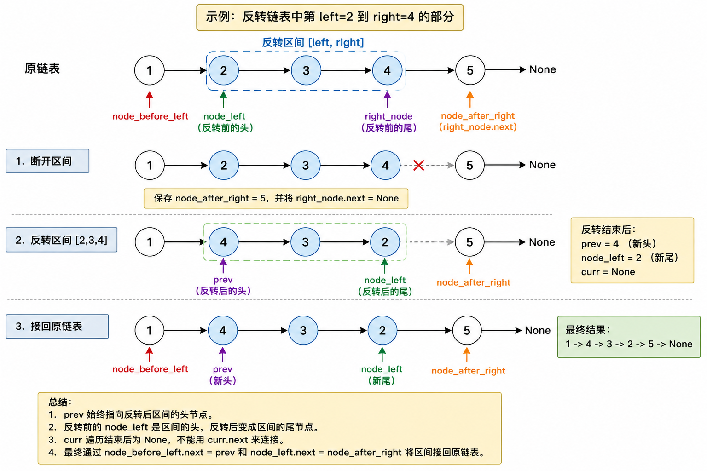

# 92. Reverse Linked List II

## 题目

给定一个单链表的头节点 `head`，以及两个位置 `left` 和 `right`。

只反转链表中第 `left` 到第 `right` 个节点之间的部分，返回新的头节点。

例如：

```text
1 -> 2 -> 3 -> 4 -> 5
left = 2
right = 4
```

反转后：

```text
1 -> 4 -> 3 -> 2 -> 5
```

## 图解



## 思路

这题是在普通反转链表的基础上，只反转中间一段。

可以把问题拆成三步：

1. 找到反转区间的前后端点。
2. 断开 `[left, right]` 区间并反转这一段。
3. 把反转后的区间接回原链表。

对于：

```text
1 -> 2 -> 3 -> 4 -> 5
left = 2
right = 4
```

需要保存四个位置：

```text
node_before_left = 1
node_left = 2
right_node = 4
node_after_right = 5
```

先断开区间：

```python
node_after_right = right_node.next
right_node.next = None
```

然后反转：

```text
2 -> 3 -> 4 -> None
```

得到：

```text
4 -> 3 -> 2 -> None
```

最后接回去：

```python
node_before_left.next = prev
node_left.next = node_after_right
```

## 反转后的端点是谁

假设反转前这一段是：

```text
A -> B -> C -> D -> None
```

标准反转模板：

```python
prev = None
curr = A

while curr:
    nxt = curr.next
    curr.next = prev
    prev = curr
    curr = nxt
```

循环结束后变成：

```text
D -> C -> B -> A -> None
```

此时：

```text
prev = D
curr = None
```

所以：

- `prev` 是反转后的新头。
- `curr` 不是端点，它已经走到 `None`。
- 原来的头 `A` 变成反转后的尾巴。

放到 92 这题里：

```text
node_left = 2
```

反转前它是区间头。

反转后：

```text
4 -> 3 -> 2
```

它变成区间尾。

因此接回去时：

```python
node_before_left.next = prev
node_left.next = node_after_right
```

不能写：

```python
curr.next = node_after_right
```

因为反转结束时：

```python
curr = None
```

`curr.next` 会报错。

## 代码

```python
class Solution:
    def reverseBetween(
        self, head: ListNode | None, left: int, right: int
    ) -> ListNode | None:
        if left == right:
            return head

        dummy = ListNode(0)
        dummy.next = head

        node_before_left = dummy
        for _ in range(left - 1):
            node_before_left = node_before_left.next

        right_node = dummy
        for _ in range(right):
            right_node = right_node.next

        node_left = node_before_left.next
        node_after_right = right_node.next
        right_node.next = None

        prev = None
        curr = node_left

        while curr:
            nxt = curr.next
            curr.next = prev
            prev = curr
            curr = nxt

        node_before_left.next = prev
        node_left.next = node_after_right

        return dummy.next
```

## 复杂度

时间复杂度：O(n)

空间复杂度：O(1)

## 心得

反转链表结束后：

```text
prev 指向新头
curr 已经越界
原来的 head 变成新尾
```

在局部反转里：

```text
node_left 是反转前左端点
node_left 反转后变成右端点
prev 是反转后的左端点
```

所以最后接回原链表时：

```python
node_before_left.next = prev
node_left.next = node_after_right
```

这题要特别小心保存端点，不然反转完以后很容易不知道该接回哪里。
