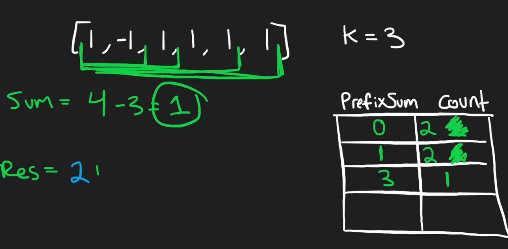

# 560. Subarray Sum Equals K

## 题目

给定一个整数数组 `nums` 和一个整数 `k`。

返回数组中和为 `k` 的连续子数组个数。

## 如何识别这类题

看到这些关键词时，可以考虑“前缀和 + 哈希表”：

- 连续子数组
- 子数组和等于某个目标值
- 数组里可能有负数
- 要求比暴力枚举更快

如果数组里都是正数，有时可以考虑滑动窗口。

但这题有负数，窗口和不一定随着右边界增加而稳定变大，所以滑动窗口不适合。

这时更适合用前缀和。

## 核心关系

设当前前缀和是：

```text
prefix_sum
```

如果之前某个位置的前缀和是：

```text
prefix_sum - k
```

那么“那个位置之后到现在”这一段子数组的和就是：

```text
prefix_sum - (prefix_sum - k) = k
```

所以每次走到当前位置，都要问：

```text
之前有多少个前缀和等于 prefix_sum - k？
```

有几个，就说明以当前位置结尾的合法子数组有几个。

## 为什么先放入 `{0: 1}`

```python
prefix_count = {0: 1}
```

表示“还没开始遍历时，前缀和为 0 出现过 1 次”。

这样可以处理从下标 `0` 开始的子数组。

例如：

```text
nums = [1, 2]
k = 3
```

当遍历到 `2` 时：

```text
prefix_sum = 3
need = 3 - 3 = 0
```

如果没有提前放入 `{0: 1}`，就找不到 `[1, 2]` 这个从开头开始的答案。

## 配图理解

下面这张图展示的是某一步的计算：



当前：

```text
prefix_sum = 4
k = 3
need = prefix_sum - k = 1
```

如果哈希表里 `prefix_sum = 1` 出现过 2 次，就说明有 2 个不同的起点，可以和当前位置组成和为 `3` 的子数组。

所以这一轮答案可以直接加 `2`。

## 代码

```python
class Solution:
    def subarraySum(self, nums: list[int], k: int) -> int:
        prefix_count = {0: 1}
        prefix_sum = 0
        count = 0

        for num in nums:
            prefix_sum += num
            need = prefix_sum - k

            count += prefix_count.get(need, 0)
            prefix_count[prefix_sum] = prefix_count.get(prefix_sum, 0) + 1

        return count
```

## 注意顺序

要先查询 `need`，再把当前 `prefix_sum` 加入哈希表。

```python
count += prefix_count.get(need, 0)
prefix_count[prefix_sum] = prefix_count.get(prefix_sum, 0) + 1
```

因为当前前缀和只能给后面的子数组使用。

如果先把当前 `prefix_sum` 放进去，可能会错误地把空子数组算进去。

## 复杂度

- 时间复杂度：O(n)
- 空间复杂度：O(n)

## 心得

1. 这是前缀和的经典题目。
2. `{0: 1}` 要提前加入哈希表，用来处理从数组开头开始的子数组。
3. 如果之前某个位置的前缀和是 `prefix_sum - k`，那么那个位置之后到现在这一段，和就是 `k`。
4. 哈希表里存的不是某个前缀和是否出现过，而是“这个前缀和出现过几次”。
5. 有负数时，不要急着用滑动窗口；前缀和 + 哈希表更稳定。
